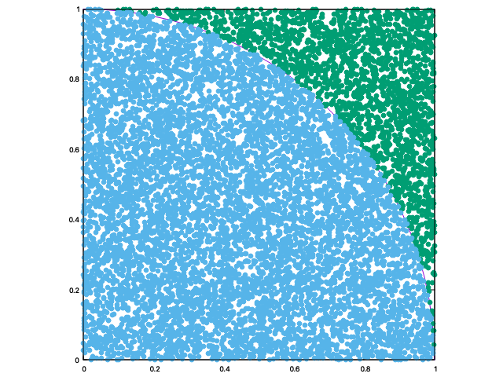

# Monte Carlo π

This is a simple program used to approximate Pi using a Monte Carlo method. This is an exercise
often used to introduce students to Monte Carlo methods.

## Contents

1. [Overview](#overview)
2. [Requirements](#requirements)
3. [Compilation and Usage](#compilation-and-usage)
4. [Known Issues](#known-issues)

## Overview

Consider a quadrant (circular sector) inscribed in a unit square. Given that the ratio of their areas is
π / 4 , the value of π can be approximated using a Monte Carlo method:

1. Draw a square, then inscribe a quadrant within it
2. Uniformly scatter a given number of points over the square
3. Count the number of points inside the quadrant, i.e. having a distance from the origin of less than 1
4. The ratio of the inside-count and the total-sample-count is an estimate of the ratio of the two areas,
   π / 4. Multiply the result by 4 to estimate π.

In this procedure the domain of inputs is the square that circumscribes the quadrant. We generate random 
inputs by scattering grains over the square then perform a computation on each input (test whether it falls within the 
quadrant). Aggregating the results yields our final result, the approximation of π.

There are two important considerations:

1. If the points are not uniformly distributed, then the approximation will be poor
2. There are many points. The approximation is generally poor if only a few points are randomly placed in the whole
   square. On average, the approximation improves as more points are placed.

Uses of Monte Carlo methods require large amounts of random numbers, and it was their use that spurred the development 
of pseudorandom number generators, which were far quicker to use than the tables of random numbers that had been previously used for statistical sampling.

## Requirements

- gcc
- gnuplot (if you would like to produce graphics)
- gsl (for using Sobol qrng, otherwise comment out that part of the code (L.48-56 in coord.cc))

## Compilation and Usage

To compile the code simply run the following command inside a terminal in the project directory:

```shell
make
```

To produce graphics, run the following commands inside the gnuplot terminal int he project directory:

```shell
set parametric
set size square
set xrange [0:1]
set yrange [0:1]
unset key
plot [0:2*pi] 1*sin(t), 1*cos(t), 'misses.txt' title "Misses" with points pointtype 7, "hits.txt" title "Hits" with points pointtype 7
```

Note: I know I can add this to the Makefile as 'make plot' but I prefer to leave the commands here so I can return to them.

## Results

As expected, our approximation of π gets better as the number of simulations N increases.

N = 100


Output:

```shell
Enter the number of simulations N to approximate π = 10000
Would you like to use Sobol's quasi-random number generator [y/n]?  n
Writing results to file: points.txt
Writing results to file: hits.txt
Writing results to file: misses.txt
Approximation of π = 3.12 for 100 simulations.
```

N = 1,000


Output:

```shell
Enter the number of simulations N to approximate π = 10000
Would you like to use Sobol's quasi-random number generator [y/n]?  n
Writing results to file: points.txt
Writing results to file: hits.txt
Writing results to file: misses.txt
Approximation of π = 3.104 for 100 simulations.
```

N = 10,000



Output:

```shell
Enter the number of simulations N to approximate π = 10000
Would you like to use Sobol's quasi-random number generator [y/n]?  n
Writing results to file: points.txt
Writing results to file: hits.txt
Writing results to file: misses.txt
Approximation of π = 3.1392 for 100 simulations.
```

As an aside, we also get quicker convergence when we use what is known as a quasi-random number generator such as
Sobol. Here is an example for N = 1,000 simulations using Sobol:


Output: 

```shell
Enter the number of simulations N to approximate π = 1000
Would you like to use Sobol's quasi-random number generator [y/n]?  y
Writing results to file: points.txt
Writing results to file: hits.txt
Writing results to file: misses.txt
Approximation of π = 3.144 for 1000 simulations.
```

To review Sobol and quasi-random number generators, check out this link [here](https://en.wikipedia.org/wiki/Sobol_sequence)


## Known Issues

None at present.
